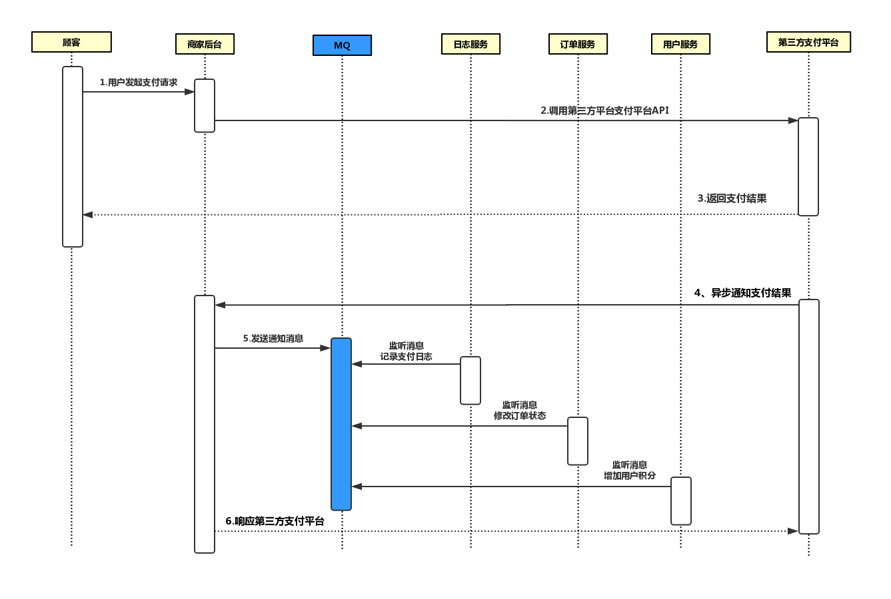

# 基于RocketMq的商城【下单】和【支付】业务

### 1）下单


### 2）支付


## 技术选型

- SpringCloudAlibaba
- Dubbo
- Nacos
- RocketMQ
- Mysql
- Knife4j


> 需要自行安装rocketMq和Nacos服务器，这里使用的RocketMq集群（双主双从），nacos是单机。整合rocketmq和java的架包是SpringCloudStream，使用knife4j是用来有界面调试请求

## 数据库

### 1）优惠券表

| Field        | Type                | Comment                  |
| ------------ | ------------------- | ------------------------ |
| coupon_id    | bigint(50) NOT NULL | 优惠券ID                 |
| coupon_price | decimal(10,2) NULL  | 优惠券金额               |
| user_id      | bigint(50) NULL     | 用户ID                   |
| order_id     | bigint(32) NULL     | 订单ID                   |
| is_used      | int(1) NULL         | 是否使用 0未使用 1已使用 |
| used_time    | timestamp NULL      | 使用时间                 |

### 2）商品表

| Field        | Type                | Comment  |
| ------------ | ------------------- | -------- |
| goods_id     | bigint(50) NOT NULL | 主键     |
| goods_name   | varchar(255) NULL   | 商品名称 |
| goods_number | int(11) NULL        | 商品库存 |
| goods_price  | decimal(10,2) NULL  | 商品价格 |
| goods_desc   | varchar(255) NULL   | 商品描述 |
| add_time     | timestamp NULL      | 添加时间 |

### 3）订单表

| Field           | Type                | Comment                                      |
| --------------- | ------------------- | -------------------------------------------- |
| order_id        | bigint(50) NOT NULL | 订单ID                                       |
| user_id         | bigint(50) NULL     | 用户ID                                       |
| order_status    | int(1) NULL         | 订单状态 0未确认 1已确认 2已取消 3无效 4退款 |
| pay_status      | int(1) NULL         | 支付状态 0未支付 1支付中 2已支付             |
| shipping_status | int(1) NULL         | 发货状态 0未发货 1已发货 2已退货             |
| address         | varchar(255) NULL   | 收货地址                                     |
| consignee       | varchar(255) NULL   | 收货人                                       |
| goods_id        | bigint(50) NULL     | 商品ID                                       |
| goods_number    | int(11) NULL        | 商品数量                                     |
| goods_price     | decimal(10,2) NULL  | 商品价格                                     |
| goods_amount    | decimal(10,0) NULL  | 商品总价                                     |
| shipping_fee    | decimal(10,2) NULL  | 运费                                         |
| order_amount    | decimal(10,2) NULL  | 订单价格                                     |
| coupon_id       | bigint(50) NULL     | 优惠券ID                                     |
| coupon_paid     | decimal(10,2) NULL  | 优惠券                                       |
| money_paid      | decimal(10,2) NULL  | 已付金额                                     |
| pay_amount      | decimal(10,2) NULL  | 支付金额                                     |
| add_time        | timestamp NULL      | 创建时间                                     |
| confirm_time    | timestamp NULL      | 订单确认时间                                 |
| pay_time        | timestamp NULL      | 支付时间                                     |

### 4）订单商品日志表

| Field        | Type                 | Comment  |
| ------------ | -------------------- | -------- |
| goods_id     | int(11) NOT NULL     | 商品ID   |
| order_id     | varchar(32) NOT NULL | 订单ID   |
| goods_number | int(11) NULL         | 库存数量 |
| log_time     | datetime NULL        | 记录时间 |

### 5）用户表

| Field         | Type                | Comment  |
| ------------- | ------------------- | -------- |
| user_id       | bigint(50) NOT NULL | 用户ID   |
| user_name     | varchar(255) NULL   | 用户姓名 |
| user_password | varchar(255) NULL   | 用户密码 |
| user_mobile   | varchar(255) NULL   | 手机号   |
| user_score    | int(11) NULL        | 积分     |
| user_reg_time | timestamp NULL      | 注册时间 |
| user_money    | decimal(10,0) NULL  | 用户余额 |

### 6）用户余额日志表

| Field          | Type                | Comment                       |
| -------------- | ------------------- | ----------------------------- |
| user_id        | bigint(50) NOT NULL | 用户ID                        |
| order_id       | bigint(50) NOT NULL | 订单ID                        |
| money_log_type | int(1) NOT NULL     | 日志类型 1订单付款 2 订单退款 |
| use_money      | decimal(10,2) NULL  | 操作金额                      |
| create_time    | timestamp NULL      | 日志时间                      |

### 7）订单支付表

| Field      | Type                | Comment            |
| ---------- | ------------------- | ------------------ |
| pay_id     | bigint(50) NOT NULL | 支付编号           |
| order_id   | bigint(50) NULL     | 订单编号           |
| pay_amount | decimal(10,2) NULL  | 支付金额           |
| is_paid    | int(1) NULL         | 是否已支付 1否 2是 |

### 8）MQ消息生产表

| Field       | Type                  | Comment             |
| ----------- | --------------------- | ------------------- |
| id          | varchar(100) NOT NULL | 主键                |
| group_name  | varchar(100) NULL     | 生产者组名          |
| msg_topic   | varchar(100) NULL     | 消息主题            |
| msg_tag     | varchar(100) NULL     | Tag                 |
| msg_key     | varchar(100) NULL     | Key                 |
| msg_body    | varchar(500) NULL     | 消息内容            |
| msg_status  | int(1) NULL           | 0:未处理;1:已经处理 |
| create_time | timestamp NOT NULL    | 记录时间            |

### 9）MQ消息消费表

| Field              | Type                  | Comment                          |
| ------------------ | --------------------- | -------------------------------- |
| msg_id             | varchar(50) NULL      | 消息ID                           |
| group_name         | varchar(100) NOT NULL | 消费者组名                       |
| msg_tag            | varchar(100) NOT NULL | Tag                              |
| msg_key            | varchar(100) NOT NULL | Key                              |
| msg_body           | varchar(500) NULL     | 消息体                           |
| consumer_status    | int(1) NULL           | 0:正在处理;1:处理成功;2:处理失败 |
| consumer_times     | int(1) NULL           | 消费次数                         |
| consumer_timestamp | timestamp NULL        | 消费时间                         |
| remark             | varchar(500) NULL     | 备注                             |


# 下单业务


#### 测试


### 支付业务




#### 测试

**创建支付**


**回调支付**


### 工程结构图

```
├─.idea
│  ├─dataSources
│  │  └─086b4427-cbbd-4f38-8a7b-ab7bd3eecb01
│  │      └─storage_v2
│  │          └─_src_
│  │              └─schema
│  ├─inspectionProfiles
│  └─libraries
├─business
│  ├─business-order-service
│  │  ├─src
│  │  │  └─main
│  │  │      ├─java
│  │  │      │  └─com
│  │  │      │      └─zzp
│  │  │      │          └─shop
│  │  │      │              └─business
│  │  │      │                  ├─config
│  │  │      │                  └─controller
│  │  │      └─resources
│  └─business-pay-service
│      ├─src
│      │  └─main
│      │      ├─java
│      │      │  └─com
│      │      │      └─zzp
│      │      │          └─shop
│      │      │              └─business
│      │      │                  ├─config
│      │      │                  └─controller
│      │      └─resources
├─commons
│  ├─common-dto
│  │  ├─src
│  │  │  └─main
│  │  │      └─java
│  │  │          └─com
│  │  │              └─zzp
│  │  │                  └─shop
│  │  │                      └─common
│  │  │                          ├─dto
│  │  │                          └─vo
│  ├─common-mapper
│  │  ├─src
│  │  │  └─main
│  │  │      └─java
│  │  │          └─tk
│  │  │              └─mybatis
│  │  │                  └─mapper
│  └─common-utils
│      ├─src
│      │  └─main
│      │      └─java
│      │          └─com
│      │              └─zzp
│      │                  └─shop
│      │                      └─common
│      │                          ├─constant
│      │                          ├─exception
│      │                          └─utils
├─dependencies
├─img
├─message
│  └─message-order-service
│      └─src
│          └─main
│              ├─java
│              └─resources
└─provider
    ├─provider-coupon-api
    │  ├─src
    │  │  └─main
    │  │      └─java
    │  │          └─com
    │  │              └─zzp
    │  │                  └─shop
    │  │                      └─provider
    │  │                          ├─api
    │  │                          └─domain
    ├─provider-coupon-service
    │  ├─src
    │  │  └─main
    │  │      ├─java
    │  │      │  └─com
    │  │      │      └─zzp
    │  │      │          └─shop
    │  │      │              └─provider
    │  │      │                  ├─listener
    │  │      │                  ├─mapper
    │  │      │                  ├─service
    │  │      │                  └─sink
    │  │      └─resources
    │  │          └─mapper
    ├─provider-goods-api
    │  ├─src
    │  │  └─main
    │  │      └─java
    │  │          └─com
    │  │              └─zzp
    │  │                  └─shop
    │  │                      └─provider
    │  │                          ├─api
    │  │                          ├─domain
    │  │                          └─dto
    ├─provider-goods-service
    │  ├─src
    │    └─main
    │        ├─java
    │        │  └─com
    │        │      └─zzp
    │        │          └─shop
    │        │              └─provider
    │        │                  ├─listener
    │        │                  ├─mapper
    │        │                  ├─service
    │        │                  └─sink
    │        └─resources
    │            └─mapper
    ├─provider-order-api
    │  ├─src
    │    └─main
    │        └─java
    │            └─com
    │                └─zzp
    │                    └─shop
    │                        └─provider
    │                            ├─api
    │                            └─domain
    ├─provider-order-service
    │  ├─src
    │    ├─main
    │    │  ├─java
    │    │  │  └─com
    │    │  │      └─zzp
    │    │  │          └─shop
    │    │  │              └─provider
    │    │  │                  ├─bind
    │    │  │                  ├─listener
    │    │  │                  ├─mapper
    │    │  │                  ├─service
    │    │  │                  └─sink
    │    │  └─resources
    │    │      └─mapper
    │    └─test
    │        └─java
    │           └─com
    │                └─zzp
    │                    └─shop
    │                        └─provider
    ├─provider-pay-api
    │  ├─src
    │    └─main
    │        └─java
    │            └─com
    │                └─zzp
    │                    └─shop
    │                        └─provider
    │                            ├─api
    │                            ├─domain
    │                            └─dto
    ├─provider-pay-service
    │  ├─src
    │    └─main
    │        ├─java
    │        │  └─com
    │        │      └─zzp
    │        │          └─shop
    │        │              └─provider
    │        │                  ├─bind
    │        │                  ├─mapper
    │        │                  └─service
    │        └─resources
    │            └─mapper    
    ├─provider-user-api
    │  ├─src
    │    └─main
    │        ├─java
    │        │  └─com
    │        │      └─zzp
    │        │          └─shop
    │        │              └─provider
    │        │                  ├─api
    │        │                  └─domain
    │        └─resources
    └─provider-user-service
        ├─src
          └─main
              ├─java
              │  └─com
              │      └─zzp
              │          └─shop
              │              └─provider
              │                  ├─listener
              │                  ├─mapper
              │                  ├─service
              │                  └─sink
              └─resources
                  └─mapper


```

